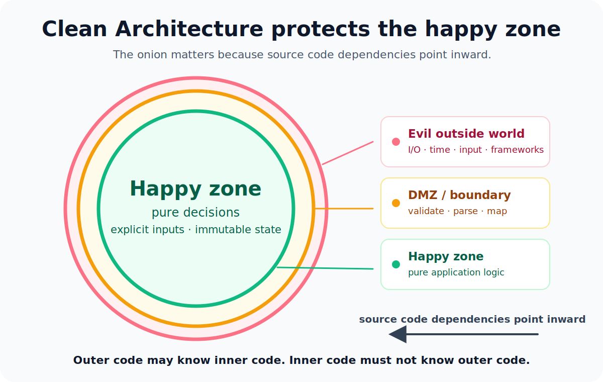

Clean Architecture is one of those ideas that is easy to draw and hard to keep in real code.

The onion diagram is useful because it shows one important rule: source code dependencies point inward. Outer code may know inner code. Inner code must not know outer code.

That sounds simple until you look at a frontend application and notice how often this rule gets violated quietly.

A use case receives a translation function. Business logic reads `new Date()` directly. Application code knows about a modal. A component passes raw network data deeper into the system because TypeScript was told to trust it. Storage, browser APIs, current time, user input and third-party responses slowly move closer to the center.

None of these things look dramatic in isolation.

Together, they make the important code expensive to change.

That is the real point of the onion.

Not folders.

Boundaries.



## The onion is useful, but it is not the architecture

The onion matters, but not because circles are architecture.

It matters because it shows what should be stable. The further inward code lives, the less it should know about the outside world. The center should not know whether the application is rendered with React, whether data came from HTTP, whether a message is shown in a toast, or whether the current language is English or German.

The inner part should know the rules.

The outer part should know the world.

When that direction is respected, the application becomes easier to reason about. When it is ignored, every small change starts to touch too many places. A UI decision becomes an application decision. A browser detail becomes a business rule. A response shape from one API becomes a type that leaks everywhere.

That is not Clean Architecture.

That is coupling with nicer folder names.

## The outside world is evil

I do not mean evil in a dramatic way.

I mean evil in a practical way.

The outside world is everything you do not fully control: user input, network responses, browser APIs, storage, date and time, random values, environment variables, third-party libraries, rendering and framework behavior.

All of these things are allowed to be messy. They are allowed to fail. They are allowed to change shape. They are allowed to be unavailable. They are allowed to be different tomorrow.

The mistake is not that the outside world is messy.

The mistake is letting that mess walk straight into the center of the application.

Dirty code at the edge is normal.

Dirty code in the center is expensive.

## The DMZ exists for a reason

Between the outside world and the happy zone, there should be a boundary.

Call it a boundary.

Call it an adapter layer.

Call it a DMZ.

The name is not important. The job is important: dirty data should not enter the application and pretend to be trusted.

This is where runtime validation belongs. This is where date parsing belongs. This is where user input verification belongs. This is where network response mapping belongs. This is where unknown failures become semantic failures.

The outside world gives you `unknown`.

The boundary turns it into application data.

This is bad:

```typescript
import { isNumber, isPlainObject, isString } from "@sindresorhus/is";

type Order = {
  id: string;
  totalInCents: number;
};

async function loadOrderTotal(): Promise<number> {
  const response = await fetch("/api/current-order");
  const order = (await response.json()) as Order;

  return order.totalInCents;
}
```

The type assertion does not validate anything. It only tells TypeScript to stop asking questions.

The code looks typed, but the application is still trusting the outside world.

A boundary should be more explicit:

```typescript
type Order = {
  id: string;
  totalInCents: number;
};

type ParseOrderResponseResult =
  | { status: "valid"; order: Order }
  | { status: "invalid"; reason: "invalidOrderResponse" };

function isRecord(value: unknown): value is Record<string, unknown> {
  return isPlainObject(value);
}

function parseOrderResponse(externalOrder: unknown): ParseOrderResponseResult {
  if (!isRecord(externalOrder)) {
    return { status: "invalid", reason: "invalidOrderResponse" };
  }

  const id = externalOrder["id"];
  const totalInCents = externalOrder["totalInCents"];

  if (!isString(id)) {
    return { status: "invalid", reason: "invalidOrderResponse" };
  }

  if (!isNumber(totalInCents)) {
    return { status: "invalid", reason: "invalidOrderResponse" };
  }

  return { status: "valid", order: { id, totalInCents } };
}
```

This is not an argument for handwritten parsers. In real code, I would often use Zod, ArkType, Valibot or a small parser here. The tool is not the architecture.

The boundary is the architecture.

The important part is that the happy zone receives an `Order`, not a random JSON blob with a TypeScript costume.

This is also why I care about [avoiding direct browser globals](/blog/avoid-direct-browser-globals), [dependency injection without frameworks](/blog/dependency-injection-without-frameworks-in-typescript), and [not throwing for expected failures](/blog/avoid-throwing-for-expected-failures-typescript).

They are different ways of protecting the same boundary.

## The happy zone should be boring

The center of the application should be boring.

That is a compliment.

Boring code is easy to read and easy to test. It does not need a browser to prove that it works. It does not need a test runner trick to make time stand still. It does not need a global mock to avoid touching the network.

The happy zone is where the application decisions live. It should mostly be pure functions with explicit input and explicit output. It should avoid hidden state. When state is needed, that state should be small, explicit and immutable.

This is the kind of code I want in the happy zone:

```typescript
type Customer = {
  kind: "guest" | "registered";
};

type Basket = {
  totalInCents: number;
};

type Discount = {
  percentage: number;
};

type CalculateDiscountOptions = {
  customer: Customer;
  basket: Basket;
};

function calculateDiscount(options: CalculateDiscountOptions): Discount {
  const { customer, basket } = options;

  if (customer.kind === "guest") {
    return { percentage: 0 };
  }

  if (basket.totalInCents < 10_000) {
    return { percentage: 0 };
  }

  return { percentage: 10 };
}
```

No React. No HTTP. No browser. No translation. No current date. No hidden global state.

Just a rule.

That does not make the whole application pure. It makes the important part protectable.

This is the place where meaningful 100% test coverage becomes realistic. Not because coverage is a religion, but because the code is small enough, deterministic enough and explicit enough that testing all meaningful branches is boring.

That is exactly what I want from important code.

## Translations belong to the UI

Translations are a good example because they look harmless.

It is tempting to return translated strings from application code. The code already knows what failed, so why not return the message directly?

Because a translated string is presentation.

It is not application meaning.

Imagine `translate` comes from the UI's i18n setup. Passing it as an argument makes the dependency visible, but visibility does not make it the right dependency.

This is the wrong direction:

```typescript
import { isUndefined } from "@sindresorhus/is";

type Translate = (key: string) => string;

type Checkout = {
  shippingAddressId: string | undefined;
  totalInCents: number;
};

type ValidateCheckoutOptions = {
  checkout: Checkout;
  translate: Translate;
};

type ValidateCheckoutResult =
  | { status: "valid" }
  | { status: "invalid"; message: string };

const paymentLimitInCents = 500_000;

function validateCheckout(
  options: ValidateCheckoutOptions
): ValidateCheckoutResult {
  const { checkout, translate } = options;

  if (isUndefined(checkout.shippingAddressId)) {
    return {
      status: "invalid",
      message: translate("checkout.error.shippingAddressMissing")
    };
  }

  if (checkout.totalInCents > paymentLimitInCents) {
    return {
      status: "invalid",
      message: translate("checkout.error.paymentLimitExceeded")
    };
  }

  return { status: "valid" };
}
```

The problem is not that `translate` is injected. Dependency injection does not make every dependency correct.

The problem is the direction. The use case now knows about translations. It calls a UI concern and returns presentation instead of meaning.

A translation key would not fix the boundary. Returning `checkout.error.paymentLimitExceeded` from this function would be less bad than returning an already translated string, but it would still make the inner layer know the shape of the translation catalog.

Inside the use case, that key is a dependency leak.

The application layer should return a semantic result:

```typescript
import { isUndefined } from "@sindresorhus/is";

type Checkout = {
  shippingAddressId: string | undefined;
  totalInCents: number;
};

type ValidateCheckoutError = "shippingAddressMissing" | "paymentLimitExceeded";

type ValidateCheckoutOptions = {
  checkout: Checkout;
};

type ValidateCheckoutResult =
  | { status: "valid" }
  | { status: "invalid"; error: ValidateCheckoutError };

const paymentLimitInCents = 500_000;

function validateCheckout(
  options: ValidateCheckoutOptions
): ValidateCheckoutResult {
  const { checkout } = options;

  if (isUndefined(checkout.shippingAddressId)) {
    return { status: "invalid", error: "shippingAddressMissing" };
  }

  if (checkout.totalInCents > paymentLimitInCents) {
    return { status: "invalid", error: "paymentLimitExceeded" };
  }

  return { status: "valid" };
}
```

Then the UI decides how that result is presented:

```typescript
type ValidateCheckoutError = "shippingAddressMissing" | "paymentLimitExceeded";

type CheckoutErrorTranslationKey =
  | "checkout.error.paymentLimitExceeded"
  | "checkout.error.shippingAddressMissing";

type Translate = (key: CheckoutErrorTranslationKey) => string;

const validateCheckoutErrorTranslationKeys: Record<
  ValidateCheckoutError,
  CheckoutErrorTranslationKey
> = {
  paymentLimitExceeded: "checkout.error.paymentLimitExceeded",
  shippingAddressMissing: "checkout.error.shippingAddressMissing"
};

type FormatValidateCheckoutErrorOptions = {
  error: ValidateCheckoutError;
  translate: Translate;
};

function formatValidateCheckoutError(
  options: FormatValidateCheckoutErrorOptions
): string {
  const { error, translate } = options;
  const translationKey = validateCheckoutErrorTranslationKeys[error];

  return translate(translationKey);
}
```

The inner layer returns meaning.

The outer layer maps that meaning to a translation key and translates it.

Here, knowing the key is fine. This function lives at the UI boundary. It maps application meaning to a UI catalog address, and then the UI can translate it, render it, log it, show a toast or attach it to a form field.

That is the dependency rule in a practical frontend example. The same applies to labels, colors, modals, toasts, date formatting and layout decisions.

The application can decide what happened.

The UI decides how humans see it.

The names may look similar, but they have different owners. `paymentLimitExceeded` is application meaning. `checkout.error.paymentLimitExceeded` is a UI translation key.

## Time is also outside world

Time is another good example because it feels too small to matter.

It is only `new Date()`.

What could go wrong?

A lot.

When application logic reads the current time directly, the dependency is hidden. Tests become more complicated. Behavior becomes harder to reproduce. The function has an input that is not visible in its signature.

This is a smell:

```typescript
type Trial = {
  customerId: string;
  startsAt: Date;
  expiresAt: Date;
};

function createTrial(customerId: string): Trial {
  const startsAt = new Date();
  const expiresAt = new Date(startsAt.getTime() + 14 * 24 * 60 * 60 * 1000);

  return {
    customerId,
    startsAt,
    expiresAt
  };
}
```

The function looks simple, but it secretly depends on the system clock.

A better version makes time explicit:

```typescript
type WallClock = {
  now: () => Date;
};

type Trial = {
  customerId: string;
  startsAt: Date;
  expiresAt: Date;
};

type CreateTrialOptions = {
  customerId: string;
  wallClock: WallClock;
};

const trialDurationInMilliseconds = 14 * 24 * 60 * 60 * 1000;

function createTrial(options: CreateTrialOptions): Trial {
  const { customerId, wallClock } = options;
  const startsAt = wallClock.now();
  const expiresAt = new Date(startsAt.getTime() + trialDurationInMilliseconds);

  return {
    customerId,
    startsAt,
    expiresAt
  };
}
```

Now the dependency is visible. Production can pass the real wall clock. Tests can pass a deterministic clock.

The exact shape does not matter. In my own code, I usually model this as a [wall clock abstraction](https://github.com/enormora/wall-clock). The application can ask for the current time, but it does not know where that time comes from.

No fake timers. No waiting. No global patching. No magic.

That is the value of the abstraction.

Not abstraction because abstraction sounds professional.

Abstraction because it gives control back to the code that needs to make a decision.

## Dependency injection is the boring mechanism

Dependency injection is often explained as a testing technique.

That is too small.

Testing is one benefit. The bigger benefit is direction. The application layer defines what it needs, and the outer layer provides the implementation.

The use case does not need to know whether a payment is submitted through one provider, another provider, a fake provider or a local test double. It only needs to know what the dependency means.

```typescript
type ChargePaymentRequest = {
  orderId: string;
  amountInCents: number;
};

type ChargePaymentError = "paymentRejected" | "paymentProviderUnavailable";

type ChargePaymentResult =
  | { status: "charged" }
  | { status: "failed"; error: ChargePaymentError };

type PaymentGateway = {
  charge: (request: ChargePaymentRequest) => Promise<ChargePaymentResult>;
};
```

The interface belongs to the application. The implementation belongs to the infrastructure.

That small distinction matters.

The inner layer says what it needs.

The outer layer says how it is done.

A dependency injection framework is optional.

A dependency direction is not.

## This is not about purity theater

Some code has to be dirty.

The browser has to be called. Data has to be fetched. Events have to be handled. Storage has to be read. Translations have to be applied. Errors have to be shown.

Clean Architecture does not remove side effects. It moves them to places where side effects are expected.

The goal is not to make every line pure.

The goal is to protect the lines that make decisions.

That is a very different thing.

## Final thought

The onion is useful, but the onion is a reminder, not the goal.

Clean Architecture is not about creating more folders. It is not about adding interfaces everywhere. It is not about pretending frontend applications are backend services.

It is about boundaries.

The outside world is messy. The DMZ protects the application from that mess. The happy zone contains the rules that should be stable, explicit and easy to test.

That is where the important decisions belong.

Not in React components. Not in browser adapters. Not in translation calls. Not behind `new Date()`. Not inside a random object that came from the network.

Clean Architecture is not valuable because the diagram looks good.

It is valuable because the center becomes boring.

And boring code is much easier to trust.
