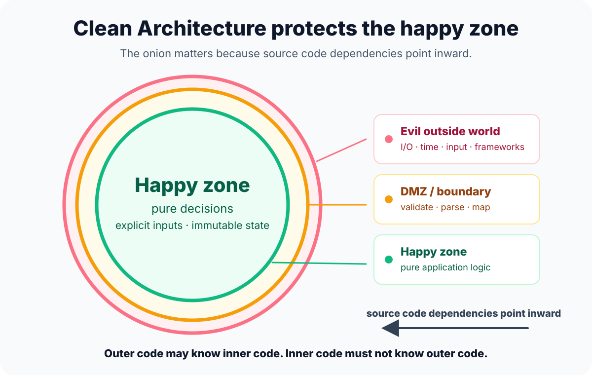

A checkout rule should be able to report a missing shipping address without knowing how the user interface explains the problem. When it calls a translation function, it also takes responsibility for choosing a UI message. A test of the rule then needs a translator even though the decision itself has nothing to do with language.

The same kind of coupling appears when a discount calculation reads browser storage or a trial calculation reads the system clock. To understand the decision, we also have to understand the environment in which it runs.

I want those decisions in a part of the application that can be understood and tested on its own. I call that part the happy zone. Clean Architecture provides a dependency rule that helps keep it that way.

## Dependencies point toward the rules

The [dependency rule in Clean Architecture](https://blog.cleancoder.com/uncle-bob/2012/08/13/the-clean-architecture.html) says that source code dependencies point inward. In practical terms, a React component can import a checkout rule, but the checkout rule should not import React or depend on the component's props. The rule describes which checkouts are allowed. The component decides how to display the result.

This applies to data types as well as function calls. A checkout rule that accepts an HTTP request object must know how to read its body and parameters. The caller can do that work and pass checkout data instead, leaving the rule independent of how the request was delivered.



The diagram is a simplified way to think about these responsibilities. The happy zone contains the decisions I want to keep pure. The surrounding DMZ is boundary code that validates external values and maps them to application data. These are labels for this explanation, not a prescribed set of Clean Architecture layers.

The diagram's "evil outside world" is shorthand for things those rules should not have to control. A network response may not match the expected contract. A stored value may come from an older application version. Reading the clock introduces a value that changes independently of the function's arguments. These dependencies need handling, but that handling does not belong in every business rule.

The benefit is concrete: changing how a value is stored should not require changing the rule that uses it, provided the value still means the same thing. The same reasoning applies to [direct access to browser globals](/blog/avoid-direct-browser-globals). Moving a function into a folder named `domain` does not create that separation if it still reads `localStorage`.

## Check external data before passing it inward

A type assertion such as `(await response.json()) as Order` does not establish that the response is an order. [Type assertions are removed during compilation](https://www.typescriptlang.org/docs/handbook/2/everyday-types.html#type-assertions); they do not check the value at runtime. A missing or incorrectly typed field can still reach the code that expects it.

The boundary should check the assumptions the application relies on and construct the data it passes inward. For this example, an order must have a nonempty ID and a nonnegative, safe-integer total in cents:

```typescript
type Order = {
  id: string;
  totalInCents: number;
};

type ParseOrderResponseResult =
  | { status: "valid"; order: Order }
  | { status: "invalid"; reason: "invalidOrderResponse" };

function isRecord(value: unknown): value is Record<string, unknown> {
  return typeof value === "object" && value !== null && !Array.isArray(value);
}

function parseOrderResponse(externalOrder: unknown): ParseOrderResponseResult {
  if (!isRecord(externalOrder)) {
    return { status: "invalid", reason: "invalidOrderResponse" };
  }

  const id = externalOrder["id"];
  const totalInCents = externalOrder["totalInCents"];

  if (typeof id !== "string" || id.length === 0) {
    return { status: "invalid", reason: "invalidOrderResponse" };
  }

  if (
    typeof totalInCents !== "number" ||
    !Number.isSafeInteger(totalInCents) ||
    totalInCents < 0
  ) {
    return { status: "invalid", reason: "invalidOrderResponse" };
  }

  return { status: "valid", order: { id, totalInCents } };
}
```

The `Order` type belongs to the application. The parser belongs to the boundary and constructs an `Order` after checking the external value. A schema library could do the checking instead; the important part is that the application receives data with an established contract. I cover that in more detail in [Runtime validation is a boundary concern](/blog/runtime-validation-is-a-boundary-concern).

This parser only deals with a decoded value. The HTTP code still has to handle unsuccessful responses and JSON decoding failures before calling it. Once it succeeds, application code no longer needs to ask whether `totalInCents` is a string or a missing property.

That does not make the order valid for every operation. Whether a customer may pay for it or whether it qualifies for a discount remains a business decision. Checking the external representation and applying those rules are different responsibilities.

## Keep decisions in ordinary functions

Once the input has a known meaning, a rule can work with it directly. Suppose registered customers receive a ten percent discount when their basket total reaches 10,000 cents:

```typescript
type Customer = {
  kind: "guest" | "registered";
};

type Basket = {
  totalInCents: number;
};

type Discount = {
  percentage: number;
};

type CalculateDiscountOptions = {
  customer: Customer;
  basket: Basket;
};

function calculateDiscount(options: CalculateDiscountOptions): Discount {
  const { customer, basket } = options;

  if (customer.kind === "guest") {
    return { percentage: 0 };
  }

  if (basket.totalInCents < 10_000) {
    return { percentage: 0 };
  }

  return { percentage: 10 };
}
```

This function does not care whether the basket came from an HTTP response, local storage or a test fixture. Its caller supplies the customer and basket and it returns the discount without changing either input. The same input values produce the same result.

That makes the tests straightforward. A guest receives no discount even with a large basket. A registered customer receives none at 9,999 cents and ten percent at 10,000 cents. Testing those cases requires no browser or network setup.

This is what I mean by a [boring core](/blog/boring-code-is-a-feature). The rule may become more involved as the product changes, but its tests should remain about the rule. When testing a discount starts to require storage mocks or mounting a component, I would first ask why those dependencies are part of the calculation.

## Return meaning instead of presentation

The checkout example from the opening has the same separation available to it. The rule can determine that a shipping address is missing without choosing the message the user sees.

Passing a `translate` function into the rule makes the dependency explicit, but it does not make it appropriate. The rule still chooses translation keys and returns presentation text. A test now has to account for that presentation concern just to check whether checkout is allowed.

Instead, `validate-checkout.ts` can return an application error:

```typescript
type Checkout = {
  shippingAddressId: string | undefined;
  totalInCents: number;
};

export type ValidateCheckoutError =
  "shippingAddressMissing" | "paymentLimitExceeded";

type ValidateCheckoutResult =
  { status: "valid" } | { status: "invalid"; error: ValidateCheckoutError };

const paymentLimitInCents = 500_000;

export function validateCheckout(checkout: Checkout): ValidateCheckoutResult {
  if (checkout.shippingAddressId === undefined) {
    return { status: "invalid", error: "shippingAddressMissing" };
  }

  if (checkout.totalInCents > paymentLimitInCents) {
    return { status: "invalid", error: "paymentLimitExceeded" };
  }

  return { status: "valid" };
}
```

A separate UI module imports the application error type and maps it to its translation catalog:

```typescript
import type { ValidateCheckoutError } from "./validate-checkout.js";

type CheckoutErrorTranslationKey =
  | "checkout.error.shippingAddressMissing"
  | "checkout.error.paymentLimitExceeded";

type Translate = (key: CheckoutErrorTranslationKey) => string;

const checkoutErrorTranslationKeys: Record<
  ValidateCheckoutError,
  CheckoutErrorTranslationKey
> = {
  shippingAddressMissing: "checkout.error.shippingAddressMissing",
  paymentLimitExceeded: "checkout.error.paymentLimitExceeded"
};

type FormatCheckoutErrorOptions = {
  error: ValidateCheckoutError;
  translate: Translate;
};

function formatCheckoutError(options: FormatCheckoutErrorOptions): string {
  const { error, translate } = options;

  return translate(checkoutErrorTranslationKeys[error]);
}
```

The dependency now points from the UI toward the application. Renaming a translation key changes this mapping, not the checkout rule. Another caller can handle the same error without translating it at all.

Returning a translation key directly from the rule would retain the coupling to the catalog. `paymentLimitExceeded` describes a condition in the application; `checkout.error.paymentLimitExceeded` identifies an entry owned by the UI. Their similar names do not give them the same responsibility. [Translations belong to the user interface](/blog/translations-belong-to-the-user-interface) develops that distinction further.

## Make time an input to the decision

A trial calculation can look self-contained while reading the clock through `new Date()`. Its result then depends on when it runs, even though its arguments do not include a start time.

For a rule that needs one timestamp I would pass that timestamp directly:

```typescript
type Trial = {
  readonly customerId: string;
  readonly startsAt: Date;
  readonly expiresAt: Date;
};

type CreateTrialOptions = {
  customerId: string;
  startsAt: Date;
};

const trialDurationInMilliseconds = 14 * 24 * 60 * 60 * 1000;

function createTrial(options: CreateTrialOptions): Trial {
  const { customerId, startsAt } = options;
  const startTimeInMilliseconds = startsAt.getTime();

  return {
    customerId,
    startsAt: new Date(startTimeInMilliseconds),
    expiresAt: new Date(startTimeInMilliseconds + trialDurationInMilliseconds)
  };
}
```

The caller supplies a valid start date. This example defines the duration as fourteen 24-hour periods, rather than a calendar-day calculation. The function constructs its own dates from that input; unlike `new Date()` with no arguments, those constructor calls do not read the current time.

Tests can supply a fixed start date and assert the expiration directly. The application code that starts the trial is responsible for obtaining the current time and passing it in.

When a workflow needs to read time as it proceeds, an injected clock is useful. In my own code I use [`@enormora/clock`](https://github.com/enormora/clock) so that production and tests can provide different clock implementations. Reading an injected clock is still an effect. Injection makes that effect explicit and controllable; passing the resulting timestamp into a calculation keeps the calculation pure. I cover clock injection in [Time is an external dependency](/blog/time-is-an-external-dependency).

## Let the application define the operations it needs

Some application code must coordinate effects. A checkout workflow may validate the order, request a payment and react to the outcome. It cannot be reduced to a pure calculation just by moving code into another module.

It can still avoid depending on a particular payment provider. The application can define the operation in its own terms:

```typescript
type ChargePaymentRequest = {
  orderId: string;
  amountInCents: number;
};

type ChargePaymentError = "paymentRejected" | "paymentProviderUnavailable";

type ChargePaymentResult =
  { status: "charged" } | { status: "failed"; error: ChargePaymentError };

type PaymentGateway = {
  charge: (request: ChargePaymentRequest) => Promise<ChargePaymentResult>;
};
```

The checkout workflow receives a `PaymentGateway`. It calls `charge` with an order ID and an amount, then handles the returned result. A separate module makes the provider-specific request and converts recognized responses into application results. This module is the payment adapter.

The `PaymentGateway` type belongs to the application. The adapter imports that type and startup code creates the adapter and passes it to the checkout workflow. The workflow does not import the adapter or the provider's SDK. Passing the implementation in this way is ordinary [dependency injection without a framework](/blog/dependency-injection-without-frameworks-in-typescript).

At runtime, calling `charge` still reaches the payment provider. The dependency rule keeps the workflow independent of the provider-specific implementation; it does not prevent the workflow from requesting a payment. The workflow still performs effects, while the rules it uses can remain pure functions.

The result type describes the [expected failures](/blog/avoid-throwing-for-expected-failures-typescript) the application handles. It does not guarantee that the promise can never reject. The adapter and the application's error handling still need to account for unexpected failures.

## Keep the separation useful

The boundary code needs tests too. A unit test for the discount does not prove that an HTTP response is parsed correctly or that the payment adapter sends the right request. Separating the code lets those tests answer different questions without making every business-rule test exercise the integration.

There is no need to reproduce every ring of a diagram as a directory or introduce an interface for every function. A small feature may need only a module containing its rules, boundary code for its external dependencies and a caller that connects them. Add a separation when it lets a real decision be understood or changed independently.

With that separation, changing the discount threshold does not involve browser storage and renaming a translation key does not involve the checkout rule. The code that reads storage and renders messages is still necessary. It just no longer has to participate in every decision the application makes.
